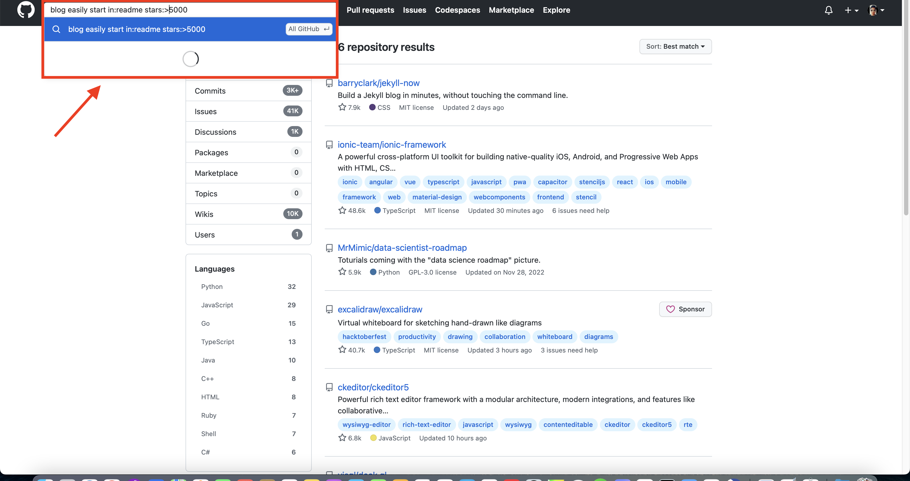
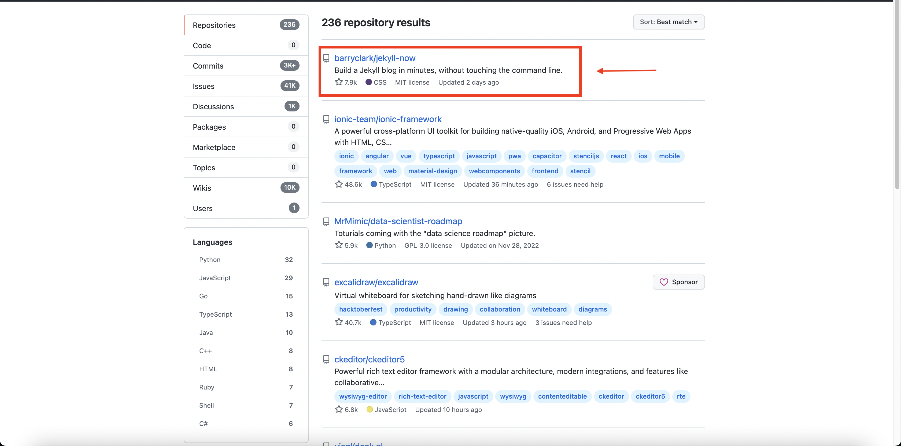
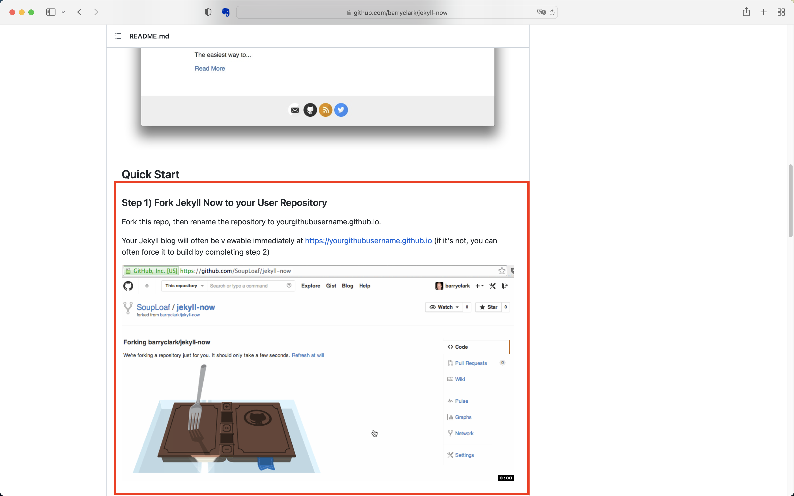
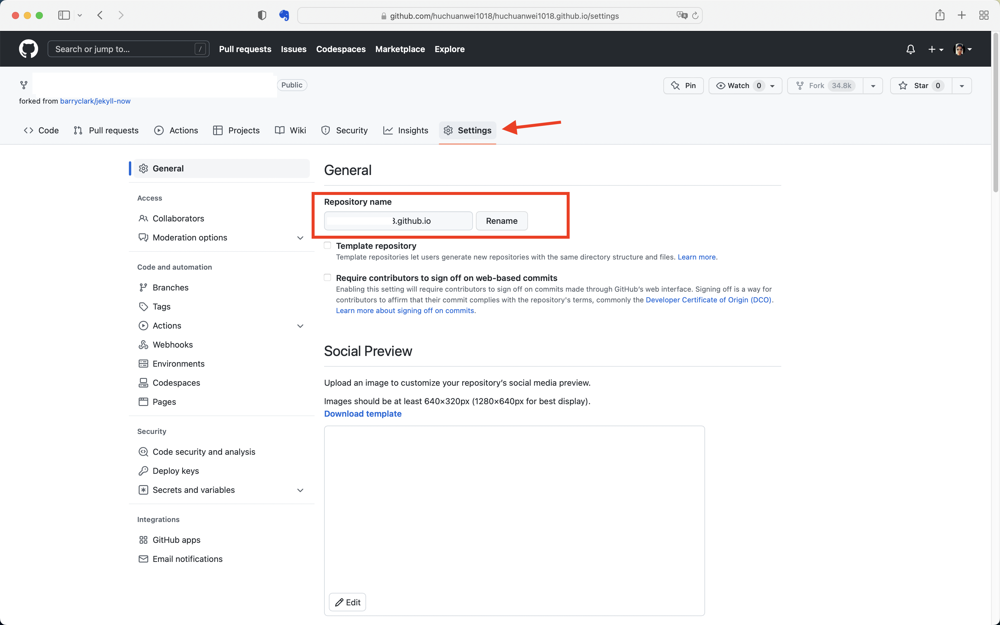
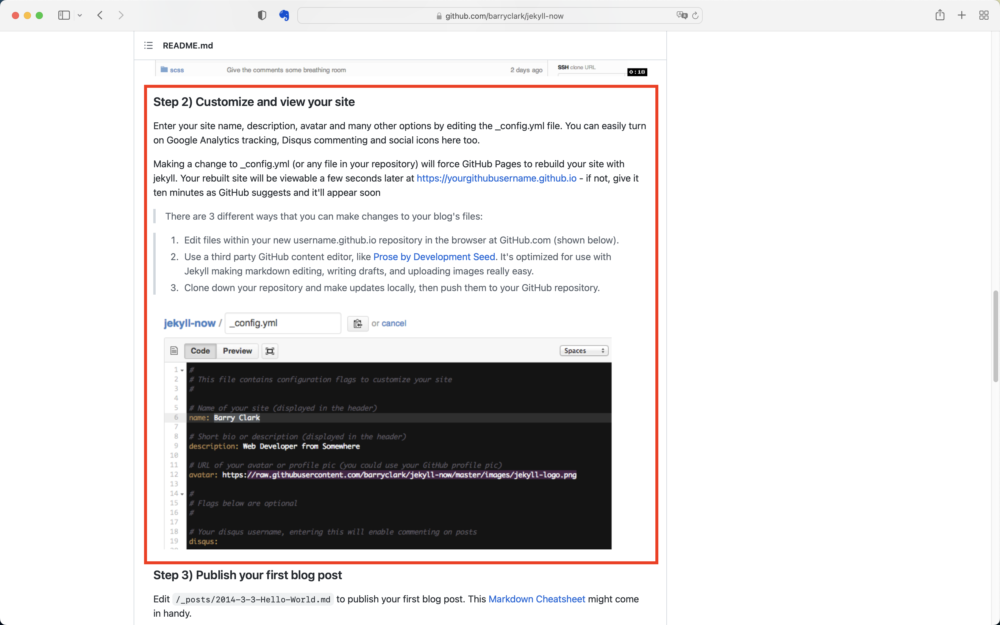
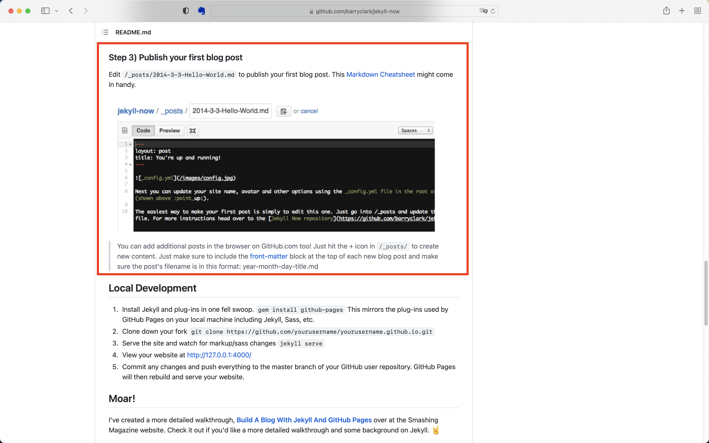

> 搭建Github博客的过程比较简单，跟着Github找到的仓库一步一步的做就可以了，关键在于通过readme文件的关键字来查找相关的github工程。

<!--more-->

## github搜索

在github搜索框中输入`blog easily start in:readme stars:>5000`

## 查看仓库

查看相关仓库的内容是否符合自身所需

## 根据步骤设置

1. Fork该仓库并修改仓库名称为`yourgithubusername.github.io`

在Fork的仓库中找到`Settings`，然后修改仓库名称，例如用户名称为`huchuanwei1018`

2. 定制网站

通过修改配置文件`_config.yml`来生成定制的网站。

3. 推送博客

将博客文章名为`year-month-day-title.md`格式，在文章中使用`front-matter`配置，然后将其放在`/_posts`文件夹下就可以查看了。

---
> Reference
> 1. [Front Matter](https://jekyllrb.com/docs/front-matter/)
> 2. [YAML](https://en.wikipedia.org/wiki/YAML)