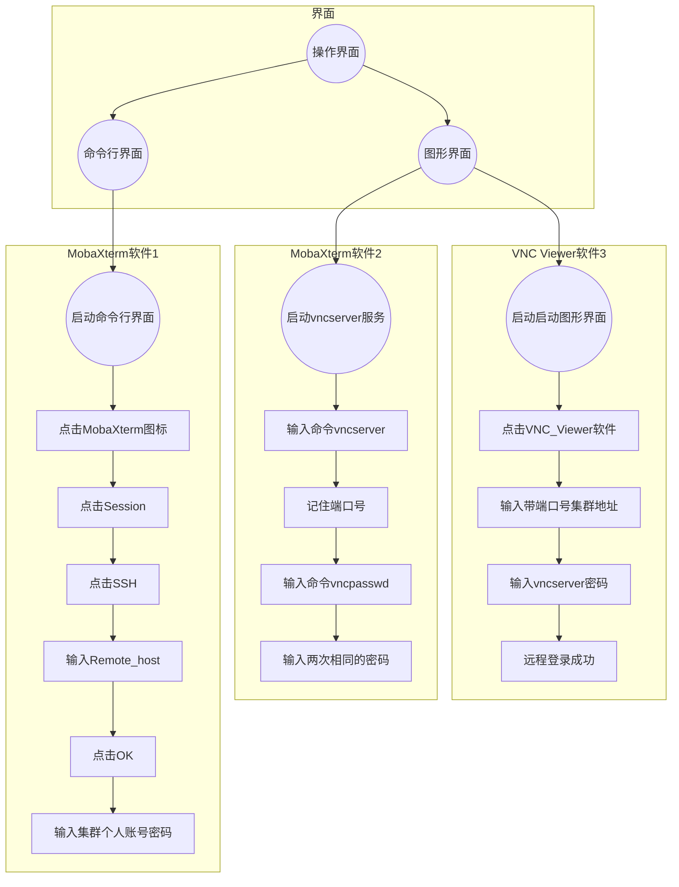

> 本文主要介绍通过Linux系统服务器的VNC远程登录。

* TOC
{:toc}

<!--more-->

## 概要

vncserver 是一个启动 VNC（虚拟网络计算）桌面的实用程序。它以适当的选项运行 Xvnc 并在 VNC 桌面上启动窗口管理器。

vncserver 允许用户在同一台机器上并行运行独立的会话，这些会话可以从任何地方被任意数量的客户端访问。

VNC server 会在服务器端启动一个监听用户要求的端口，一般端口号码在 5901 ~ 5910 之间。当客户端启动 X server 联机到 5901 之后， VNC server 再将一堆预先设定好的 X client 透过这个联机传递到客户端上，最终就能够在客户端显示服务器的图形接口了。

不过需要注意的是，预设的 VNC server 都是独立提供给『单一』一个客户端来联机的，因此当你要使用 VNC 时， 再联机到服务器去启动 VNC server 即可。所以，一般来说， VNC server 都是使用手动启动的，然后使用完毕后， 再将 VNC server 关闭即可。

一般通过Windows系统里的`SSH`和`VNC`软件工具远程登陆Linux系统，其中`MobaXterm`为命令行界面软件，`VNC Viewer`为图形化界面软件。

## 安装

1. 查询相关软件

```shell
# 查询tiger开头的软件
[root@c1 ~]# rpm -qa | grep '^tiger'
```

根据查询结果，系统没有安装tigervnc和tigervnc-server，所以都需要安装。

2. 安装相关软件

```shell
[root@c1 ~]# sudo yum install tigervnc tigervnc-server
```

## 使用流程

### 主服务器端设置

VNC 服务器可以被配置为一个或多个用户启动显示，前提是系统上存在这些用户的帐户，并且可以指定一些可选参数，如显示设置、网络地址和端口以及安全设置。

1. 单个用户配置NVC

```shell
# 复制vncserver@.service文件
[root@c1 ~]# cp /lib/systemd/system/vncserver@.service /etc/systemd/system/vncserver@:1.service

# 进入到配置文件目录
[root@c1 ~]# cd /etc/systemd/system

# 修改配置文件
[root@c1 ~]# vim vncserver@:1.service
[Unit]
Description=Remote desktop service (VNC)
After=syslog.target network.target
 
[Service]
Type=simple # 改成simple

ExecStartPre=/bin/sh -c '/usr/bin/vncserver -kill %i > /dev/null 2>&1 || :'
ExecStart=/usr/sbin/runuser -l User -c "/usr/bin/vncserver %i" # 修改<USER>为对应的用户User
PIDFile=/home/User/.vnc/%H%i.pid   # 修改对应用户User的位置，启动VNC后对应操作系统的进程号
ExecStop=/bin/sh -c '/usr/bin/vncserver -kill %i > /dev/null 2>&1 || :'
 
[Install]
WantedBy=multi-user.target
```

> - 为两个用户配置 VNC 服务器
>> 如果您想在同一台机器上配置多个用户，请为每个用户创建不同的模板式服务文件。
>> 1. 创建两个服务文件，例如 vncserver-USER_1@:3.service 和 vncserver-USER_2@:5.service。在这两个文件中将 USER 替换为正确的用户名。
>> 2. 为两个用户设置密码：
>> 
>> ```shell
>> ~]$ su - USER_1
>> ~]$ vncpasswd
>> 密码:
>> 确认:
>> ~]$ su - USER_2
>> ~]$ vncpasswd
>> 密码:
>> 确认
>> ```

2. 启用配置文件

```shell
# 重载所有修改过的配置文件
[root@c1 ~]# systemctl daemon-reload

# 启动vncserver服务
[root@c1 ~]# systemctl start vncserver@:1

# 启动状态查看
[root@c1 ~]# systemctl status vncserver@:1
 vncserver@:1.service - Remote desktop service (VNC)
   Loaded: loaded (/usr/lib/systemd/system/vncserver@:1.service; enabled; vendor preset: disabled)
   Active: failed (Result: exit-code) since Mon 2022-07-04 10:45:18 CST; 1min 32s ago
  Process: 8193 ExecStop=/bin/sh -c /usr/bin/vncserver -kill %i > /dev/null 2>&1 || : (code=exited, status=0/SUCCESS)
  Process: 8157 ExecStart=/sbin/runuser -l User -c /usr/bin/vncserver %i (code=exited, status=98)
  Process: 8146 ExecStartPre=/bin/sh -c /usr/bin/vncserver -kill %i > /dev/null 2>&1 || : (code=exited, status=0/SUCCESS)
 Main PID: 8157 (code=exited, status=98)

# 设置开机启动
[root@c1 ~]# systemctl enable vncserver@:1
ln -s '/etc/systemd/system/vncserver@:1.service' '/etc/systemd/system/multi-user.target.wants/vncserver@:1.service'
```

3. 设置防火墙

```shell
# 列出监听中tcp和udp传输协议连接的程序识别码和程序名称
[root@c1 ~]# netstat -tulnp | grep vnc
tcp        0      0 0.0.0.0:5901            0.0.0.0:*        LISTEN      3594/Xvnc
tcp        0      0 0.0.0.0:6001            0.0.0.0:*        LISTEN      3594/Xvnc
tcp6       0      0 :::5901                 :::*            LISTEN      3594/Xvnc
tcp6       0      0 :::6001                 :::*            LISTEN      3594/Xvnc


# 永久添加vnc-server服务到防火墙规则中
[root@c1 ~]# firewall-cmd --permanent --add-service="vnc-server" --zone="public"

# 重新加载防火墙规则
[root@c1 ~]# firewall-cmd --reload
```

### 客户端设置

远程登录包含命令行界面和图形界面，登录的方法如下：

1. 命令行界面

   - 进入无盘系统，点击MobaXterm 图标
   - 在MobaXterm的页面上，点击左下角Session
   - 在新页面的左上角点击SSH选项
     - 在Remote host处输入集群IP地址。如192.168.1.101（服务器地址）
     - 点击OK
   - 出现命令行界面，输入集群个人账号密码
   - 启动图形界面服务
     - 输入命令：vncserver -geometry 1920x1020 # -geometry设置分辨率
     - 记住此时的端口号，如New'c1:06'，表示5906端口号
     - 设置vncserver密码
       - 输入命令：vncpasswd
       - 输入两次相同的密码
       - 出现命令行`Would you like to enter a view-only password(y/n)?`，输入n
2. 图形界面
   
   - 桌面点击VNC Viewer 图标，启动VNC Viewer
   - 在界面输入框中输入含有命令行界面出现的端口号集群地址，如192.168.1.101:06
   - 出现弹窗，点击continue
   - 输入vncsever密码后，远程登录成功

> - 注意
>> VNC 桌面的默认尺寸是 1024x768。
>> 可以通过 ~/.vnc/config 文件进一步配置用户的 VNC 会话。
>> 例如，要更改 VNC 窗口大小，添加以下行：
>> `geometry= <WIDTH> x <HEIGHT>`



### 为 VNC 配置防火墙

当使用非加密连接时，`firewalld` 可能会阻止 VNC 连接。为了允许 `firewalld` 传递 VNC 数据包，可以打开特定端口以允许 `TCP` 流量。如果使用 `-via` 选项，流量将通过 `SSH` 重定向，而 `SSH` 在 `firewalld` 中默认是启用的。

VNC 服务器的默认端口是 5900。要到达远程桌面可用的端口，需将默认端口与分配给用户的显示编号相加。例如，对于第二个显示：2 + 5900 = 5902。

对于显示编号 `0` 至 `3`，可以通过 `firewalld` 对 VNC 服务的支持，使用 `service` 选项来实现。需要注意的是，对于大于 `3` 的显示编号，需要具体打开相应的端口，具体方法参见 [在 firewalld 中打开端口](https://docs.redhat.com/en/documentation/red_hat_enterprise_linux/7/html/system_administrators_guide/ch-TigerVNC#proc-Opening-Ports_in_firewalld "在 firewalld 中打开端口")。

#### 在 firewalld 中启用 VNC 服务

1. 运行以下命令查看关于 `firewalld` 设置的信息：

    ```shell
    ~]$ firewall-cmd --list-all
    ```

2. 若要允许来自特定地址的所有 VNC 连接，请使用如下命令：

    ```shell
    ~\]# firewall-cmd --add-rich-rule='rule family="ipv4" source address="192.168.122.116" service name=vnc-server accept'
    success
    ```

    注意这些更改不会在下次系统启动后持续。为了永久更改防火墙规则，请重复命令并添加 `--permanent` 选项。有关防火墙丰富语言命令的更多信息，请参阅 [Red Hat Enterprise Linux 7 安全指南](https://access.redhat.com/documentation/en-US/Red_Hat_Enterprise_Linux/7/html/Security_Guide/)。
    

3. 要验证上述设置，请使用如下命令：

    ```shell
    ~\]# firewall-cmd --list-all
    public (default, active)
     interfaces: bond0 bond0.192
     sources:
     services: dhcpv6-client ssh
     ports:
     masquerade: no
     forward-ports:
     icmp-blocks:
     rich rules:
    	rule family="ipv4" source address="192.168.122.116" service name="vnc-server" accept
    ```

要打开特定端口或端口范围，可以使用 `firewall-cmd` 命令行工具的 `--add-port` 选项。例如，VNC 显示 `4` 需要为 `TCP` 流量打开端口 `5904`。

#### 在 firewalld 中打开端口

1. 以 `root` 身份在公共区域打开端口用于 `TCP` 流量，请发出如下命令：

    ```shell
    ~\]# firewall-cmd --zone=public --add-port=5904/tcp
    success
    ```

2. 要查看当前为公共区域开放的端口，请发出如下命令：

    ```shell
    ~\]# firewall-cmd --zone=public --list-ports
    5904/tcp
    ```

端口可以使用 `firewall-cmd --zone=_zone_ --remove-port=_number/protocol_` 命令移除。

## 名词解释

- VNC：VNC（Virtual Network Computing），为一种使用RFB协议的屏幕画面分享及远程操作软件。此软件借由网络，可发送键盘与鼠标的动作及即时的屏幕画面。VNC与操作系统无关，因此可跨平台使用，例如可用Windows连线到某Linux的计算机，反之亦同。甚至在没有安装客户端程序的计算机中，只要有支持JAVA的浏览器，也可使用。VNC包含客户端和服务器两个操作软件。
- VNC Server：VNC服务器，接收VNC Viewer的连接请求，传输画面到客户端。本例需要在centos7上安装VNC Server
- VNC Viewer：VNC客户端，将键盘和鼠标的动作转递给服务器，本例需要在windows上安装Viewer连接到远程的Linux服务器

## 软件教程

### 命令使用

1. chkconfig和systemctl命令对比

| 任务         | 旧指令                           | 新指令                                                                                      |
|------------|-------------------------------|------------------------------------------------------------------------------------------|
| 使某服务自动启动   | chkconfig --level 3 httpd on  | systemctl enable httpd.service                                                           |
| 使某服务不自动启动  | chkconfig --level 3 httpd off | systemctl disable httpd.service                                                          |
| 检查服务状态     | service httpd status          | systemctl status httpd.service （服务详细信息） systemctl is-active httpd.service （仅显示是否 Active) |
| 显示所有已启动的服务 | chkconfig --list              | systemctl list-units --type=service                                                      |
| 启动服务       | service httpd start           | systemctl start httpd.service                                                            |
| 停止服务       | service httpd stop            | systemctl stop httpd.service                                                             |
| 重启服务       | service httpd restart         | systemctl restart httpd.service                                                          |
| 重载服务       | service httpd reload          | systemctl reload httpd.service                                                           |

2. 常用的系统命令

| systemctl命令                                      | 说明                 |
|--------------------------------------------------|--------------------|
| systemctl                                        | 列出所有的系统服务          |
| systemctl list-units                             | 列出所有启动unit         |
| systemctl list-unit-files                        | 列出所有启动文件           |
| systemctl list-units –type=service –all          | 列出所有service类型的unit |
| systemctl list-units –type=service –all grep cpu | 列出 cpu电源管理机制的服务    |
| systemctl list-units –type=target –all           | 列出所有target         |
| systemctl list-unit-files --type=socket          | 列出所有可用系统套接口        |

3. systemctl特殊的用法

| systemctl命令                     | 说明            |
|---------------------------------|---------------|
| systemctl is-active [unit type] | 查看服务是否运行      |
| systemctl is-enable [unit type] | 查看服务是否设置为开机启动 |
| systemctl mask [unit type]      | 注销指定服务        |
| systemctl unmask [unit type]    | 取消注销指定服务      |

1. 配置文件含义

配置文件通常包含三个部分：

- `[Unit]` — 包含不依赖于单元类型的通用选项。这些选项提供了单元描述、指定了单元的行为，并设置了与其他单元的依赖关系。有关最常用的 `[Unit]` 选项列表，请参见表 10.9，“重要的 [Unit] 部分选项”。
- `[unit type]` — 如果单元具有类型特定的指令，这些指令将被分组在一个以单元类型命名的部分下。例如，服务单元文件包含 `[Service]` 部分。
- `[Install]` — 包含由 `systemctl enable` 和 `disable` 命令使用的单元安装信息。例如，有关 `[Install]` 选项列表。

这里主要介绍`[Service]` 部分的含义：

| 选项部分              | 描述                                                                                                                                                                                                                                                                                                                                                                                                              |
|-------------------|-----------------------------------------------------------------------------------------------------------------------------------------------------------------------------------------------------------------------------------------------------------------------------------------------------------------------------------------------------------------------------------------------------------------|
| `Type`            | 配置影响 `ExecStart` 及其相关选项功能的单元进程启动类型。具体类型包括：\- `simple` – 默认值。由 `ExecStart` 启动的进程是服务的主要进程。\- `forking` – 由 `ExecStart` 启动的进程会生成一个子进程，该子进程将成为服务的主要进程。父进程在启动完成后退出。\- `oneshot` – 类似于 `simple`，但进程在启动后续单元之前会退出。\- `dbus` – 类似于 `simple`，但在主要进程获取 D-Bus 名称之后才会启动后续单元。\- `notify` – 类似于 `simple`，但在通过 `sd_notify()` 函数发送通知消息之后才会启动后续单元。\- `idle` – 类似于 `simple`，但实际上的服务二进制文件执行会被延迟，直到所有任务完成，这样可以避免状态输出与服务的 shell 输出混合。 |
| `ExecStart`       | 指定在单元启动时要执行的命令或脚本。`ExecStartPre` 和 `ExecStartPost` 分别指定在 `ExecStart` 之前和之后执行的自定义命令。`Type=oneshot` 允许指定多个自定义命令，这些命令将按顺序执行。                                                                                                                                                                                                                                                                                       |
| `ExecStop`        | 指定在单元停止时要执行的命令或脚本。                                                                                                                                                                                                                                                                                                                                                                                              |
| `ExecReload`      | 指定在单元重新加载时要执行的命令或脚本。                                                                                                                                                                                                                                                                                                                                                                                            |
| `Restart`         | 启用此选项后，服务在其进程退出后将自动重启，除非是由 `systemctl` 命令干净地停止的。                                                                                                                                                                                                                                                                                                                                                                |
| `RemainAfterExit` | 如果设置为 `True`，则服务即使在所有进程退出后仍被视为处于活动状态。默认值为 `False`。此选项在配置了 `Type=oneshot` 时尤其有用。                                                                                                                                                                                                                                                                                                                                 |

### 脚本教程

## 常见问题

### 1. Job for vncserver@:1.service failed

1. 问题

[root@c1 ~]## systemctl start vncserver@:1.service
Job for vncserver@:1.service failed because the control process exited with error code. See "systemctl status vncserver@:1.service" and "journalctl -xe" for details.

1. 解决

删除/tmp/.X11-unix/ 目录，再启用一次即可

[root@c1 ~]## \rm -R /tmp/.X11-unix/
[root@c1 ~]## systemctl enable vncserver@:1.service

或者

```shell
# 修改配置文件
[root@c1 ~]# vim vncserver@:1.service
[Unit]
Description=Remote desktop service (VNC)
After=syslog.target network.target
 
[Service]
Type=simple # 改成simple

ExecStartPre=/bin/sh -c '/usr/bin/vncserver -kill %i > /dev/null 2>&1 || :'
ExecStart=/usr/sbin/runuser -l User -c "/usr/bin/vncserver %i" # 修改<USER>为对应的用户User
PIDFile=/home/User/.vnc/%H%i.pid   # 修改对应用户User的位置，启动VNC后对应操作系统的进程号
ExecStop=/bin/sh -c '/usr/bin/vncserver -kill %i > /dev/null 2>&1 || :'
 
[Install]
WantedBy=multi-user.target
```
将Type由默认的forking改为simple

### 2. VNC viewer黑屏

1. 关闭防火墙对VNC端口的限制（`firewall-cmd --permanent --zone=public --add-port=5950/tcp`和`firewall-cmd --reload`）
2. 先kill掉vncserver服务，然后重新启动vncserver
3. 查看环境变量是否正确
4. 查看`~/.bashr`和`/etc/profile`文件中环境变量，例如默认加载conda环境无法显示界面


## Additional Resources

### Documentation

1. [managing_services_with_systemd](https://access.redhat.com/documentation/en-us/red_hat_enterprise_linux/7/html/system_administrators_guide/chap-managing_services_with_systemd)
2. [第十一章、远程联机服务器SSH / XDMCP / VNC / RDP](http://cn.linux.vbird.org/linux_server/0310telnetssh_4.php)
3. [systemd.service(5) — Linux manual page](https://www.man7.org/linux/man-pages/man5/systemd.service.5.html)
4. [How to connect to a remote computer using VNC in Linux](https://www.redhat.com/sysadmin/vnc-screen-sharing-linux)
5. [Chapter 13. TigerVNC](https://docs.redhat.com/en/documentation/red_hat_enterprise_linux/7/html/system_administrators_guide/ch-tigervnc#sec-configuring-vnc-server)

### Useful Websites

1. [CentOS 7下 VNC 服务的配置和开启、常见问题](https://blog.csdn.net/weixin_44992607/article/details/125634701)
2. [CentOs 7安装配置VNC Server](https://www.jianshu.com/p/35640fc5672b)
3. [Systemd 入门教程：命令篇](https://www.ruanyifeng.com/blog/2016/03/systemd-tutorial-commands.html)
4. [linux之systemctl命令](https://zhuanlan.zhihu.com/p/505588224)
5. [How to Install and Configure VNC Server in CentOS and RHEL](https://www.tecmint.com/install-and-configure-vnc-server-in-centos-7/)
6. [Linux下netstat命令详解](https://www.cnblogs.com/gucb/p/12887275.html)
7. [How To Write A Simple Systemd Service](https://linuxconfig.org/how-to-write-a-simple-systemd-service)

### Related Books

1. [鸟哥的 Linux 私房菜 -- 基础学习篇目录 第三版](http://cn.linux.vbird.org/linux_basic/linux_basic.php)
2. [鸟哥的 Linux 私房菜 -- 基础学习篇目录 第四版](https://wizardforcel.gitbooks.io/vbird-linux-basic-4e/content)
3. [鸟哥的 Linux 私房菜 -- 服务器架设篇 第三版](http://cn.linux.vbird.org/linux_server/)
